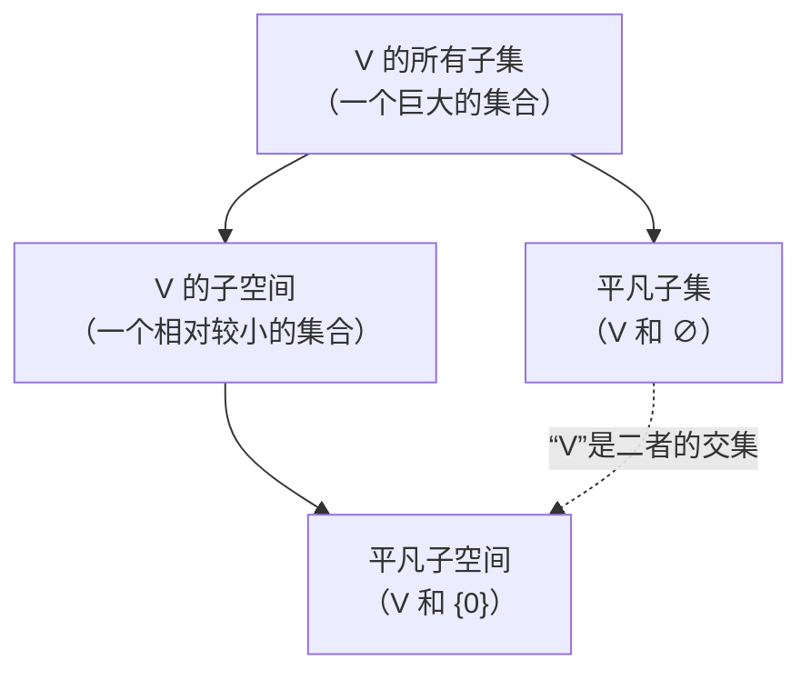

---
tags:
  - 矩阵
  - 数学概念
---

### 核心区别总结

| 概念 | 定义 | 是否含零向量？ | 是否是子空间？ | 与空间 $V$ 的关系 |
| :--- | :--- | :--- | :--- | :--- |
| **空集 $\emptyset$** | 不包含任何元素的集合 | **否** | **绝对否** | $V$ 的子集，但**绝不是**子空间 |
| **零子空间 $\{\mathbf{0}\}$** | 只包含零向量这一个元素的集合 | **是** | **是** | $V$ 的**子集**，也是**最小的子空间** |
| **平凡子集** | 一个集合本身和空集 | 不一定 | 不一定 | 特指 $V$ 和 $\emptyset$ 这两个**子集** |
| **平凡子空间** | 一个空间本身和零子空间 | 是 | **是** | 特指 $V$ 和 $\{\mathbf{0}\}$ 这两个**子空间** |

---

### 1. 零子空间 vs. 空集

这是最根本的区别：**零子空间绝对不是空集，空集也绝对不可能成为子空间。**

*   **空集 ($\emptyset$)**：
    *   **是什么**： 什么都不包含的集合。数学符号为 $\emptyset$ 或 $\{\}$。
    *   **是否包含零向量**： **不包含**。空集就是什么都没有，自然也没有零向量。
    *   **是否是子空间**： **绝对不是**。要成为子空间，第一条就是必须包含零向量。空集连最基本的“入场券”都没有。

*   **零子空间 ($\{\mathbf{0}\}$)**：
    *   **是什么**： 只包含一个元素——零向量——的集合。
    *   **是否包含零向量**： **包含**。它就是由零向量这一个元素组成的。
    *   **是否是子空间**： **是**。我们之前验证过，它对加法和数乘都是封闭的（`0 + 0 = 0`, `k·0 = 0`）。

**类比**：
*   **空集** 就像一个**完全空荡荡的房间**，里面一个人都没有。
*   **零子空间** 就像房间里**只有一个人，而这个人是“原点”（零向量）**。

---

### 2. 平凡子集 vs. 平凡子空间

这两个概念都带有“平凡”二字，但指代的对象完全不同。**它们的区别在于“子集”和“子空间”这两个词。**

*   **平凡子集 (Trivial Subsets)**：
    *   **定义**： 对于**任何**集合 $V$（不一定是线性空间），它都有两个“显而易见”的子集：
        1.  **空集** ($\emptyset$)
        2.  **集合自身** ($V$)
    *   **范围**： 这是一个**集合论**中的概念，适用于**所有集合**（比如一个班级所有人的集合，其平凡子集就是“空集”和“整个班级”）。
    *   **与线性空间的关系**： 如果 $V$ 恰好是一个线性空间，那么它的平凡子集是 $\emptyset$ 和 $V$。但请注意，$\emptyset$ **不是**子空间，只有 $V$ 同时是子集和子空间。

*   **平凡子空间 (Trivial Subspaces)**：
    *   **定义**： 对于**线性空间** $V$，它都有两个“显而易见”的**子空间**：
        1.  **零子空间** ($\{\mathbf{0}\}$)
        2.  **自身空间** ($V$)
    *   **范围**： 这是一个**线性代数**中的概念，**只适用于线性空间**。
    *   **与子集的关系**： 零子空间 $\{\mathbf{0}\}$ 和自身空间 $V$ 当然也是 $V$ 的**子集**，但它们特指那些具有**子空间结构**的子集。

### 图解关系

为了更好地理解，我们画一个图来表示所有子集和所有子空间的关系。假设 $V$ 是一个线性空间（例如 $\mathbb{R}^2$）。

**解读这个图：**
*   **大圆圈**是 $V$ 的所有子集，数量极其庞大（如果 $V$ 是 $\mathbb{R}^2$，它有无限多个子集）。
*   **小圆圈**是 $V$ 的子空间，数量少得多（对于 $\mathbb{R}^2$，只有 $\{\mathbf{0}\}$、所有过原点的直线、和 $\mathbb{R}^2$ 自身）。
*   **平凡子集** ($V$ 和 $\emptyset$) 是大圆圈中的两个特殊元素。
*   **平凡子空间** ($V$ 和 $\{\mathbf{0}\}$) 是小圆圈中的两个特殊元素。
*   **关键点**：空集 $\emptyset$ 是**平凡子集**，但它落在**子空间**的圈子**之外**。而 $V$ 本身既是**平凡子集**也是**平凡子空间**。

---

### 总结与记忆技巧

1.  **空集 vs. 零空间**：
    *   **空集**： 什么都没有。**永远不是**子空间。
    *   **零子空间**： 有一样东西（零向量）。**永远是**子空间。

2.  **平凡子集 vs. 平凡子空间**：
    *   **平凡子集**： 说的是**子集**。对于**任何集合**，都是指它**自己**和**空集**。
    *   **平凡子空间**： 说的是**子空间**。对于**线性空间**，都是指它**自己**和**零子空间**。

**一句话记住：**
*   一个线性空间 $V$ 的**平凡子集**是：$V$ 和 $\emptyset$。
*   一个线性空间 $V$ 的**平凡子空间**是：$V$ 和 $\{\mathbf{0}\}$。
*   **$\emptyset$ 是子集但不是子空间；$\{\mathbf{0}\}$ 既是子集也是子空间。**