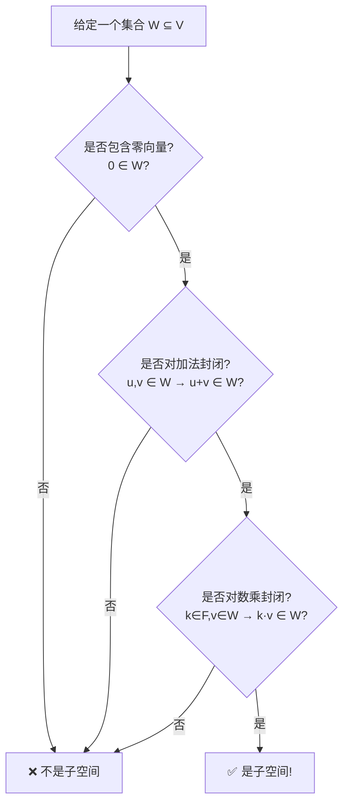

---
tags:
  - 数学概念
  - 矩阵
---

好的，这是一个非常核心的区别。**子集**是一个**集合论**概念，而**子空间**是一个**线性代数**概念。它们之间有关联，但要求完全不同。

我们可以用以下这个简单的类比来理解：

*   **子集 (Subset)**： 就像从一栋大楼（大集合 $V$）里随便划出一些房间（元素）组成一个区域。这个区域可以有任何形状，可以包含任何房间，**没有结构要求**。
*   **子空间 (Subspace)**： 就像是从这栋大楼里划出的一个**完整的、功能齐全的“子公司”**。这个子公司**自己必须是一栋独立的大楼**，拥有自己的前台（零向量）、能内部沟通（加法封闭）、能缩放办公室（数乘封闭）。

---

### 核心区别对比

| 特性 | 子集 | 子空间 |
| :--- | :--- | :--- |
| **定义范畴** | **集合论** | **线性代数** |
| **要求** | 无要求，只要是**一部分元素**的集合即可。 | **要求极其严格**，必须满足三大公理。 |
| **核心条件** | $W \subseteq V$ （$W$ 包含在 $V$ 中） | 1. 包含零向量   2. 对加法封闭   3. 对数乘封闭 |
| **类比** | **任意划分的区域** | **功能独立的子公司** |
| **例子（在 $V = \mathbb{R}^2$ 中）** | $\{(1, 0)\}$, $\{(x,y) \| x>0\}$, 单位圆 | $\{\mathbf{0}\}$, 任意过原点的直线, $\mathbb{R}^2$本身 |

---

### 详细解释

#### 1. 子集 (Subset)

*   **定义**： 如果集合 $W$ 中的每一个元素都属于集合 $V$，那么 $W$ 就是 $V$ 的一个**子集**。记作 $W \subseteq V$。
*   **要求**： **没有任何额外要求**。只要元素来自 $V$，无论这些元素如何组合，都是子集。
*   **例子**：
    *   $V = \mathbb{R}^2$（所有二维实向量）
    *   $W_1 = \{(1, 2), (3, 4)\}$ （$V$ 中的两个点）✅ 是子集
    *   $W_2 = \{(x, y) \ | \ x^2 + y^2 < 1\}$ （单位圆内部的所有点）✅ 是子集
    *   $W_3 = \{(x, y) \ | \ x > 0\}$ （右半平面）✅ 是子集
    *   $W_4 = \emptyset$ （空集）✅ 是子集

#### 2. 子空间 (Subspace)

*   **定义**： 如果线性空间 $V$ 的一个**子集** $W$，**本身**也构成一个线性空间（满足加法和数乘的封闭性等公理），那么 $W$ 就是 $V$ 的一个**子空间**。
*   **要求**： **要求极其严格**。一个子集 $W$ 要成为子空间，必须同时满足以下三个条件：
    1.  **包含零向量**： $\mathbf{0} \in W$。
    2.  **对加法封闭**： 如果 $\mathbf{u}, \mathbf{v} \in W$，那么 $\mathbf{u} + \mathbf{v} \in W$。
    3.  **对数乘封闭**： 如果 $k \in \mathbb{F}$（标量域）, $\mathbf{v} \in W$，那么 $k\mathbf{v} \in W$。
*   **例子**（同样用 $V = \mathbb{R}^2$）：
    *   $W_1 = \{(1, 2), (3, 4)\}$ ❌ **不是子空间**。
        *   *原因*： 不包含零向量 `(0,0)`；`(1,2) + (3,4) = (4,6)` 不在 $W_1$ 中；对数乘也不封闭。
    *   $W_2 = \{(x, y) \ | \ x^2 + y^2 < 1\}$ ❌ **不是子空间**。
        *   *原因*： 不包含零向量（严格 `<1`，不包括 `(0,0)`）；两个在圆内的向量相加，结果可能跑到圆外（例如 `(0.6, 0.6) + (0.6, 0.6) = (1.2, 1.2)`，其模长 $>1$）。
    *   $W_3 = \{(x, y) \ | \ x > 0\}$ ❌ **不是子空间**。
        *   *原因*： 不包含零向量（`(0,0)` 的 `x` 不大于 `0`）；一个正数向量乘以一个负数标量（如 `-1 * (1, 1) = (-1, -1)`），结果不在右半平面。
    *   $W_4 = \{\mathbf{0}\}$ ✅ **是子空间**。（零子空间）
    *   $W_5 = \{(x, 0) \ | \ x \in \mathbb{R}\}$ ✅ **是子空间**。（x轴）
    *   $W_6 = \mathbb{R}^2$ ✅ **是子空间**。（自身空间）

### 重要结论与关系

从上面的对比和例子，我们可以得出几个关键结论：

1.  **从属关系**：
    **子空间 $\subset$ 子集**
    所有子空间首先都是子集，但**绝大多数子集都不是子空间**。子空间是子集中非常特殊、要求极其严格的一小部分。

2.  **判断流程**：
    判断一个集合 $W$ 是不是线性空间 $V$ 的子空间，遵循一个清晰的流程，如下图所示：

3.  **几何意义**：
    *   在 $\mathbb{R}^2$ 和 $\mathbb{R}^3$ 中，子空间有明确的几何形象：**原点**、**过原点的直线**、**过原点的平面**、**空间本身**。
    *   任何**不过原点**的直线、曲线、图形所构成的集合，都**只是子集，而不是子空间**。

### 总结

| 特征 | 子集 | 子空间 |
| :--- | :--- | :--- |
| **本质** | **内容的集合** | **具有结构的空间** |
| **门槛** | **极低** | **极高** |
| **关系** | 子空间 **一定是** 子集 | 子集 **绝大多数不是** 子空间 |
| **关键** | 只关心**有哪些元素** | 更关心**元素之间的运算关系** |

简单来说：**子空间是一个“自我完善”的子集，你在里面进行任何加法和数乘操作，都不会“撞墙”跑到外面去。** 而子集没有这个保证。